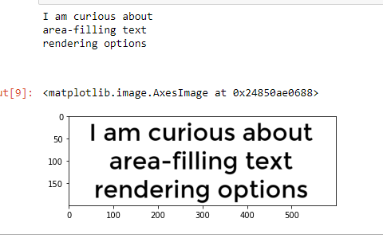

# pytesseract
This package contains an OCR engine - libtesseract and a command line program - tesseract. Tesseract 4 adds a new neural net (LSTM) based OCR engine which is focused on line recognition, but also still supports the legacy Tesseract OCR engine of Tesseract 3 which works by recognizing character patterns. Compatibility with Tesseract 3 is enabled by using the Legacy OCR Engine mode (--oem 0). It also needs traineddata files which support the legacy engine, for example those from the tessdata repository.

## Installation Guide
1. pip install pytesseract
2. https://ftp.halifax.rwth-aachen.de/osdn/sfnet/t/te/tesseract-ocr-alt/tesseract-ocr-setup-3.02.02.exe
3. pytesseract.pytesseract.tesseract_cmd = r'C:\Tesseract-OCR\tesseract'

### Output

